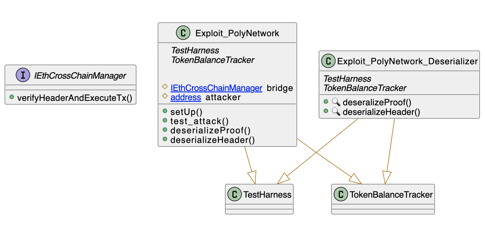
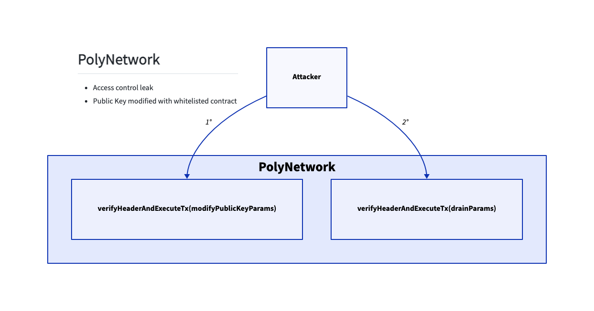

# Polynetwork Bridge
- **Type:** Exploit
- **Network:** Ethereum / Moonbean
- **Total lost**: ~611MM USD (some returned)
- **Category:**: Bruteforce
- **Vulnerable contracts:**
- - [0x250e76987d838a75310c34bf422ea9f1ac4cc906](https://etherscan.io/address/0x250e76987d838a75310c34bf422ea9f1ac4cc906)
- **Attack transactions:**
- - Sign tx: [0xb1f70464bd95b774c6ce60fc706eb5f9e35cb5f06e6cfe7c17dcda46ffd59581](https://etherscan.io/tx/0xb1f70464bd95b774c6ce60fc706eb5f9e35cb5f06e6cfe7c17dcda46ffd59581)
- - Loot tx: [0xad7a2c70c958fcd3effbf374d0acf3774a9257577625ae4c838e24b0de17602a](https://etherscan.io/tx/0xad7a2c70c958fcd3effbf374d0acf3774a9257577625ae4c838e24b0de17602a)
- **Attacker Addresses**: 
- - [0xC8a65Fadf0e0dDAf421F28FEAb69Bf6E2E589963](https://etherscan.io/address/0xC8a65Fadf0e0dDAf421F28FEAb69Bf6E2E589963)
- **Attack Block:**: 12996659, 12996671 
- **Date:** Aug 10, 2021 
- **Reproduce:** `forge test --match-contract Exploit_PolyNetwork -vvv` 

## Step-by-step 
1. Find a string such that the sighash of `{string}(bytes,bytes,uint64)` matches `putCurEpochConPubKeyBytes`.
2. Execute a cross-chain tx using said string as a `_method` and calling the manager contract, telling it to put yourself as a guardian. 
3. Forge cross-chain messages.

## Detailed Description

The Polynetwork Bridge has [EthCrosschainManager contract](https://github.com/polynetwork/eth-contracts/blob/d16252b2b857eecf8e558bd3e1f3bb14cff30e9b/contracts/core/cross_chain_manager/logic/EthCrossChainManager.sol#L127) with an `_executeCrossChainTx` which, as the name implies, executes a transaction. This method takes an arbitrary contract as a parameter, and will call a method which has a sighash corresponding to `{_method}(bytes,bytes,uint64)`, where `{_method}` is also user supplied.

``` solidity
    function verifyHeaderAndExecuteTx(
        bytes memory proof, 
        bytes memory rawHeader, 
        bytes memory headerProof, 
        bytes memory curRawHeader,
        bytes memory headerSig
        ) whenNotPaused public returns (bool){
            ...
            require(
                _executeCrossChainTx(
                    toContract, 
                    toMerkleValue.makeTxParam.method, 
                    toMerkleValue.makeTxParam.args,
                    toMerkleValue.makeTxParam.fromContract, 
                    toMerkleValue.fromChainID
                ), "Execute CrossChain Tx failed!");
            ...
        
            return true;
        }

    function _executeCrossChainTx(
        address _toContract, 
        bytes memory _method, 
        bytes memory _args, 
        bytes memory _fromContractAddr, 
        uint64 _fromChainId
        ) internal returns (bool){
        // Ensure the targeting contract gonna be invoked is indeed a contract rather than a normal account address
        require(Utils.isContract(_toContract), "The passed in address is not a contract!");
        bytes memory returnData;
        bool success;
        
        // The returnData will be bytes32, the last byte must be 01;
        (success, returnData) = _toContract.call(abi.encodePacked(bytes4(keccak256(abi.encodePacked(_method, "(bytes,bytes,uint64)"))), abi.encode(_args, _fromContractAddr, _fromChainId)));
        
        // Ensure the executation is successful
        require(success == true, "EthCrossChain call business contract failed");
        
        // Ensure the returned value is true
        require(returnData.length != 0, "No return value from business contract!");
        (bool res,) = ZeroCopySource.NextBool(returnData, 31);
        require(res == true, "EthCrossChain call business contract return is not true");
        
        return true;
    }

```

This is intended to be implemented by contracts that want to receive cross-chain transactions, and the message is intended to be signed by a set of `keepers`, a federation in charge of making sure a transaction has finalized in a network and is ready to be relayed to the other.

This federation is managed by the [EthCrossChainData contract](https://github.com/polynetwork/eth-contracts/blob/d16252b2b857eecf8e558bd3e1f3bb14cff30e9b/contracts/core/cross_chain_manager/data/EthCrossChainData.sol#L45).

Now, the attacker exploited two facts:
1. The `EthCrossmainManager` is set as the `owner` of the `EthCrossChainData` contract.
2. The sighash is only 4 bytes long, making it vulnerable to bruteforce.

The attacker targeted the `putCurEpochConPubKeyBytes` method on the `EthCrossChainData`. To perform the attack, they only had to find a `_method` string so that `keccak("{_method}(bytes,bytes,uint64)")[0:4] == keccak(putCurEpochConPubKeyBytes(bytes))`. Turns out that `f1121318093` as `_method` does the trick.

```sh
$ cast sig 'f1121318093(bytes,bytes,uint64)'                                                         ~
0x41973cd9
$ cast sig 'putCurEpochConPubKeyBytes(bytes)'                                                        ~
0x41973cd9
```

Note that only the four first bytes match! Finding a collision like this for the full keccak should be extremely hard (to the point of being impossible, unless `keccak` is broken)

``` sh
$ cast keccak 'putCurEpochConPubKeyBytes(bytes)'                                                     ~
0x41973cd9ca2c3f7fa28309a71815e084e9827b0551227e684c70c7d6c9e5e031
$ cast keccak 'f1121318093(bytes,bytes,uint64)'                                                      ~
0x41973cd95e41447fbb4f155da56b91d5b31daf7e54600218eb7b6c8384048c4c
```

Once this is done, the attacker can simply forge cross chain messages.

## Possible mitigations
- Do not rely on `sighash` to be non-reversible by bruteforce.
- Always implement as many restrictions as possible on calls to external contracts. In this case, a restriction should have been made so that cross-chain transactions to the manager are not possible for the public.

## Diagrams and graphs

### Class



### Call graph



## Sources and references
- [Retk News Writeup](https://rekt.news/polynetwork-rekt/)
- [Kudelski Security Article](https://research.kudelskisecurity.com/2021/08/12/the-poly-network-hack-explained/)
