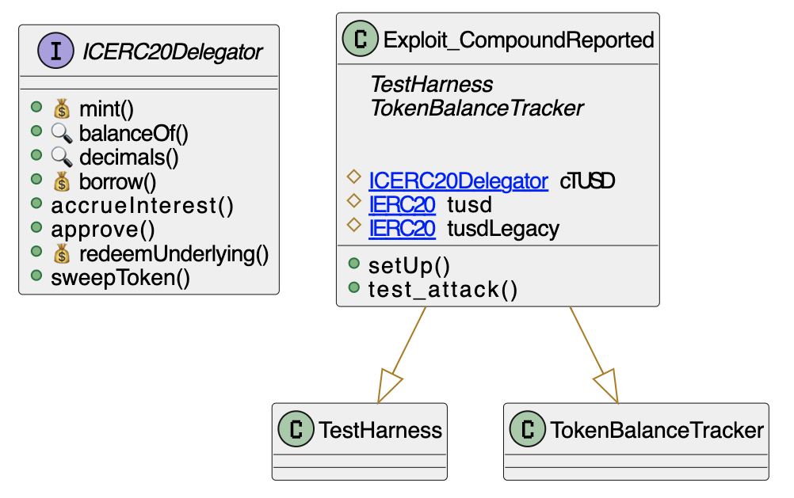
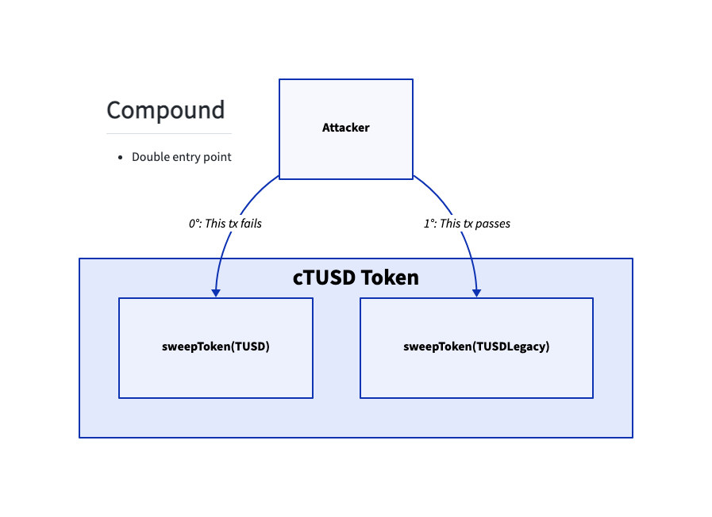

# Compound TUSD integration Issue
- **Type:** Report
- **Network:** Ethereum 
- **Total lost**: -
- **Category:** Reinitialization
- **Vulnerable contracts:**
- - [0x12392F67bdf24faE0AF363c24aC620a2f67DAd86](https://etherscan.io/address/0x12392F67bdf24faE0AF363c24aC620a2f67DAd86)
- **Attack transactions:**
- - None
- **Attacker Addresses**: 
- - None
- **Attack Block:**: -
- **Date:** Mar 21, 2022 (public disclosure)
- **Reproduce:** `forge test --match-contract Report_Compound -vvv`

## Step-by-step 
1. Call `sweepToken` specifying the secondary address of `tUSD`.
2. Take advantage of the new price of `tUSD` now that there is no underlying balance.

## Detailed Description
The issue was discovered by [ChainSecurity during their audit](https://medium.com/chainsecurity/trueusd-compound-vulnerability-bc5b696d29e2) of Compound.

The most important fact to understand is that the `tUSD` has two contracts. This is similar in how a proxy contract works, but there are implementation differences (`tUSD` was developed before proxy standards were popularized).

`tUSD` has a primary contract and a legacy contract. The legacy contract delegates its calls to the primary contract. Note how this is different from current proxy designs: the legacy contract delegates call to the current one, but the current one can still be used directly!

Now, Compound implemented a `sweepToken` method. This method is supposed to transfer all the balances of a token from the contract to an admin. This is useful in case users mistakenly send a token (say, USDC) by mistake to the contract. With this, they can call `sweepToken` and contact the admin so their funds are returned.

``` solidity
pragma solidity ^0.8.6;

function sweepToken(EIP20NonStandardInterface token) override external {
    require(address(token) != underlying, "CErc20::sweepToken: can not sweep underlying token");
    uint256 balance = token.balanceOf(address(this));
    token.transfer(admin, balance);
}
```

It is important for this method to check that `token` is not its underlying! If it were, one could transfer all of the balance's of the contract to the admin. Remember, this is intended for mistakes. The contract is _supposed to_ have balances of its underlying!

Now we have the two pieces of the puzzle to understand the vulnerability. This `sweepToken` does not work for tokens like `tUSD`. An attacker can supply the address of the `legacy tUSD` contract, which will pass the `require` clause (because the legacy one is not underlying) but will return the balances of the `primary tUSD` and transfer from it!

This causes the internal exchange rate of the contract to change, which elevates this vulnerablity from a griefing to a lucrative exploit for an attacker.

## Diagrams and graphs

### Class



### Call graph



## Possible mitigations
- [ChainSecurity](https://medium.com/chainsecurity/trueusd-compound-vulnerability-bc5b696d29e2) proposes an interesting fix: checking the underlying balance before and after the `transfer` to make sure it stays the same.

## Sources and references
- [OpenZeppelin's Writeup](https://blog.openzeppelin.com/compound-tusd-integration-issue-retrospective/)
- [Chainsecurity's Writeup](https://medium.com/chainsecurity/trueusd-compound-vulnerability-bc5b696d29e2))
- [Source code](https://etherscan.io/address/0xa035b9e130f2b1aedc733eefb1c67ba4c503491f#code)
