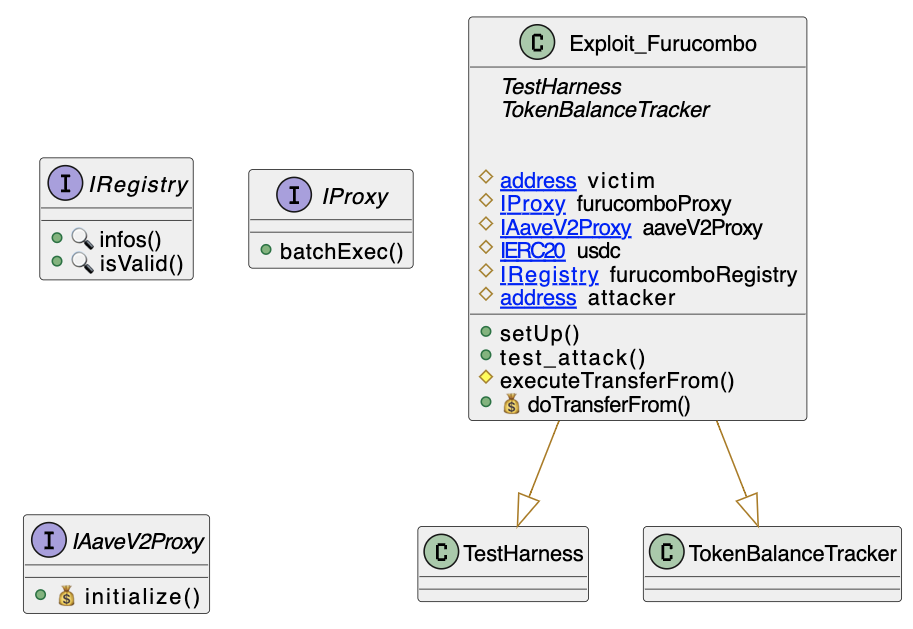

# Furucombo
- **Type:** Exploit
- **Network:** Ethereum 
- **Total lost:** ~$15MM USD (in different tokens)
- **Category:** Bad usage of `DELEGATECALL`
- **Vulnerable contracts:**
- - [0x17e8Ca1b4798B97602895f63206afCd1Fc90Ca5f](https://etherscan.io/address/0x17e8Ca1b4798B97602895f63206afCd1Fc90Ca5f)
- **Attack transactions:**
- - [0x8bf64bd802d039d03c63bf3614afc042f345e158ea0814c74be4b5b14436afb9](https://etherscan.io/tx/0x8bf64bd802d039d03c63bf3614afc042f345e158ea0814c74be4b5b14436afb9)
- **Attacker Addresses**: 
- - EOA: [0xb624e2b10b84a41687caec94bdd484e48d76b212](https://etherscan.io/address/0xb624e2b10b84a41687caec94bdd484e48d76b212)
- - Contract: [0x86765dde9304bEa32f65330d266155c4fA0C4F04](https://etherscan.io/address/0x86765dde9304bEa32f65330d266155c4fA0C4F04)
- **Attack Block:**: 11940500 
- **Date:** Feb 27, 2021
- **Reproduce:** `forge test --match-contract Exploit_Furucombo -vvv`

## Step-by-step 
1. Set up a malicious contract 
2. Call AAVE through Furucombo and initialize it from Furucombo's POV
3. Now your malicious contract _is_ AAVE from Furucombo's POV
4. Use Furucomob's `DELEGATECALL` to steal the tokens users had `approved` to Furucombo

## Detailed Description

`DELEGATE` call is always dangerous, as it requires complete trust in the code that you are running the context of the caller contract. Its most common use is upgradability, and even there it has some nasty footguns one should be aware of.

But Furucombo uses `DELEGATECALL` in a way that is particularly dangerous: it allows users to `DELEGATECALL` into several contracts, as long as they are in a whitelist.

``` solidity
    /**
     * @notice The execution of a single cube.
     * @param _to The handler of cube.
     * @param _data The cube execution data.
     */
    function _exec(address _to, bytes memory _data)
        internal
        returns (bytes memory result)
    {
        require(_isValid(_to), "Invalid handler");
        _addCubeCounter();
        assembly {
            let succeeded := delegatecall(
                sub(gas(), 5000),
                _to,
                add(_data, 0x20),
                mload(_data),
                0,
                0
            )
            let size := returndatasize()

            result := mload(0x40)
            mstore(
                0x40,
                add(result, and(add(add(size, 0x20), 0x1f), not(0x1f)))
            )
            mstore(result, size)
            returndatacopy(add(result, 0x20), 0, size)

            switch iszero(succeeded)
                case 1 {
                    revert(add(result, 0x20), size)
                }
        }
    }
```

Now, one of these whitelisted contracts was AAVE. AAVE, as many other  contracts, is upgradable: this means it is only itself a proxy that does `DELEGATECALL` to an implementation contract.

If the storage slot where the implementation address is not set, anyone can set it. From AAVE's perspective, this was set and all was working. But when Furucombo delegated the call, it is now using **its storage**  to run AAVE's code. From this perspective, AAVE's was not initialized.

So now, the attacker only has to tell Furucombo to `DELEGATECALL` into AAVE and run its `initialize()` method, setting their own malicious `EVIL AAVE` as the implementation. Now, when calling AAVE, users would actually be interacting with the malicious contract, which can run arbitrary code in the context of Furucombo. The attacker used this to steal as many funds as possible.

## Possible mitigations

1. Be **extremely** careful when using `DELEGATECALL`
2. Do not whitelist useless contracts. AAVE has no reason to be in the whitelist, as it actually did not work (it would not be able to find its implementation, balances, or anything else when run through Furucombo's Proxy)
3. The attack was so profitable because there where many users who had approved Furucombo to use their funds in different tokens. 

## Diagrams and graphs

### Class



## Sources and references
- [Furucombo Twitter](https://twitter.com/furucombo/status/1365743633605959681)
- [Slowmist Writeup](https://slowmist.medium.com/slowmist-analysis-of-the-furucombo-hack-28c9ae558db9)
- [Origin Protocol Writeup](https://github.com/OriginProtocol/security/blob/master/incidents/2021-02-27-Furucombo.md)
-[MrToph's Reproduction](https://github.com/MrToph/replaying-ethereum-hacks/blob/master/test/furucombo.ts)
