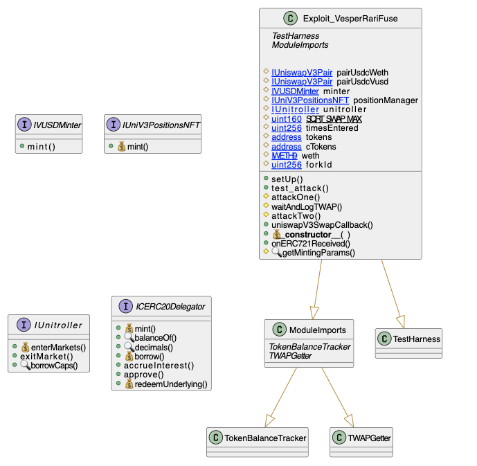

# Rari Fuse
- **Type:** Exploit
- **Network:** Ethereum 
- **Total lost**: ~$3MM USD
- **Category:** Price Manipulation
- **Vulnerable contracts:**
- - [0x8dDE0A1481b4A14bC1015A5a8b260ef059E9FD89](https://etherscan.io/address/0x8dDE0A1481b4A14bC1015A5a8b260ef059E9FD89)
- **Attack transactions:**
- - Manipulation:  [0x89d0ae4dc1743598a540c4e33917efdce24338723b0fabf34813b79cb0ecf4c5](https://etherscan.io/tx/0x89d0ae4dc1743598a540c4e33917efdce24338723b0fabf34813b79cb0ecf4c5)
- - Borrow: [0x8527fea51233974a431c92c4d3c58dee118b05a3140a04e0f95147df9faf8092](https://etherscan.io/tx/0x8527fea51233974a431c92c4d3c58dee118b05a3140a04e0f95147df9faf8092)
- **Attacker Addresses**: 
- - EOA: [0xa3f447feb0b2bddc50a44ccd6f412a5f98619264](https://etherscan.io/address/0xa3f447feb0b2bddc50a44ccd6f412a5f98619264)
- - Contract: [0x7993e1d66ffb1ab3fb1cb3db87219f532c25bdc8](https://etherscan.io/address/0x7993e1d66ffb1ab3fb1cb3db87219f532c25bdc8)
- **Attack Block:**: 13537922, 13537933
- **Date:** Nov 02, 2022
- **Reproduce:** `forge test --match-contract Exploit_VesperRariFuse -vvv`

## Step-by-step 
1. Call `sweepToken` specifying the secondary address of `tUSD`.
2. Take advantage of the new price of `tUSD` now that there is no underlying balance.

## Detailed Description

Rari Fuse is a platform in where anyone can create their own lending platform, specifying which assets can be traded. The attacker here targeted Pool 23, managed by Vesper.

The attack is relatively simple, although it does involve puting the capital at risk. 

The attacker's call trace is a bit more complicated, but conceptually what they did was buying out all the `VUSD` in the pool. The pool will now value `VUSD` extremely high, much higher than its market price.

This can't be executed by a flash-loan, because the pool uses Uniswap's V3 Time-Weighted Average Price Oracle to set its price. But the attacker simply used its own capital. This is possible due to the relatively low liquidity of the pool (only ~200K of `VUSD` available).

Normally, one would expected arbitrers to return the price to something close to the current market price. This didn't happen in time. 

The attacker was thus left with a lot of overprice `VUSD`, which they used to take out loans using it as a collateral.

## Possible mitigations
- Most likely, the solution to this is offchain. If managing a low-liquidity pool, it is advisable to run an arbitrers to protect against this kind of manipulations.
- Setting the TWAP with a higher delay can also help smoothing the curve, but there's always a risk of going too far and not being able to react in time to natural price variations.

## Diagrams and graphs

### Class

## Sources and references
- [Raricapital's Twitter](https://twitter.com/RariCapital/status/1455569653820973057?s=20&t=MampCtubjv8Rf6QhoQAqQg)
- [Vesperfi's Twitter](https://twitter.com/VesperFi/status/1455567032536248324?s=20&t=BKKLTvDar5uJ0R33t3vZdw)
- [Cmichel's Writeup](https://cmichel.io/replaying-ethereum-hacks-rari-fuse-vusd-price-manipulation/)
- [Vesper Finance's Article](https://medium.com/vesperfinance/on-the-vesper-lend-beta-rari-fuse-pool-23-exploit-9043ccd40ac9)
