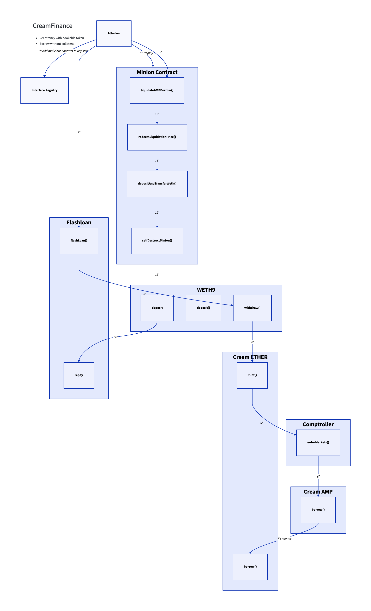

# CreamFinance
- **Type:** Exploit
- **Network:** Mainnet
- **Total lost**: ~$18MM in AMP and WETH
- **Category:** Reentrancy
- **Exploited contracts:**
- - crETH: https://etherscan.io/address/0xD06527D5e56A3495252A528C4987003b712860eE
- - crAMP: https://etherscan.io/address/0x2Db6c82CE72C8d7D770ba1b5F5Ed0b6E075066d6
- **Attack transactions:**
- - https://etherscan.io/tx/0xa9a1b8ea288eb9ad315088f17f7c7386b9989c95b4d13c81b69d5ddad7ffe61e
- **Attack Block:**: 13125071 
- **Date:** Aug 30, 2021
- **Reproduce:** `forge test --match-contract Exploit_CreamFinance -vvv`

## Step-by-step 
1. Add the contract to the universal interface registry
2. Request a Flashloan
3. Swap WETH for ETH
4. Mint crETH tokens
5. Enter Markets using crETH as collateral
6. Borrow crAMP against crETH
7. Deploy a minion contract
8. Reenter borrowing crETH in the AMP receive hook
9. The minion liquidates the main contract (commander).
10. The liquidated amount is transferred from the minion to the commander.
11. Selfdestruct the minion
12. Swap ETH for WETH
13. Repay the loan

## Detailed Description
The attacker reentered multiple pools borrowing WETH and AMP repeatedly over 17 txns.

This was possible mainly because the lending protocol transfers borrowed tokens before updating the internal accountancy values. In addition to this, as hookable tokens were used, the attacker was able to trigger a reentrant call to different contract which state was related with the first contract's. 

``` solidity
    function borrow(uint borrowAmount) external returns (uint) {
        return borrowInternal(borrowAmount);
    }

    function borrowInternal(uint borrowAmount) internal nonReentrant returns (uint) {
        ...

        return borrowFresh(msg.sender, borrowAmount);
    }

    function borrowFresh(address payable borrower, uint borrowAmount) internal returns (uint) {
        ...

        doTransferOut(borrower, borrowAmount);

        // We write the previously calculated values into storage 
        accountBorrows[borrower].principal = vars.accountBorrowsNew;
        accountBorrows[borrower].interestIndex = borrowIndex;
        totalBorrows = vars.totalBorrowsNew;

        // We emit a Borrow event 
        emit Borrow(borrower, borrowAmount, vars.accountBorrowsNew, vars.totalBorrowsNew);

        // We call the defense hook 
        comptroller.borrowVerify(address(this), borrower, borrowAmount);
        return uint(Error.NO_ERROR);
    }
```
Because the reentrancy mutex only protects functions that include that modifier, the attacker was able to call another contract borrowing undercollateralized amount.


## Possible mitigations
- Respect the checks-effects-interactions pattern whenever it's possible taking into account that a reentrancy mutex does not protect against cross-contract attacks.

## Diagrams and graphs

### Overview



### Class


## Sources and references
- [Cream Finance Tweet](https://twitter.com/creamdotfinance/status/1432249773575208964)
- [Cream Finance Post Mortem](https://medium.com/cream-finance/post-mortem-exploit-oct-27-507b12bb6f8e)
- [InspexCo Medium Post](https://inspexco.medium.com/reentrancy-attack-on-cream-finance-incident-analysis-1c629686b6f5)
- [Contract Source Code](https://etherscan.io/address/0xC9d8a3b9c39B71969280fC249C87B5d0CB77F3c9#code)
