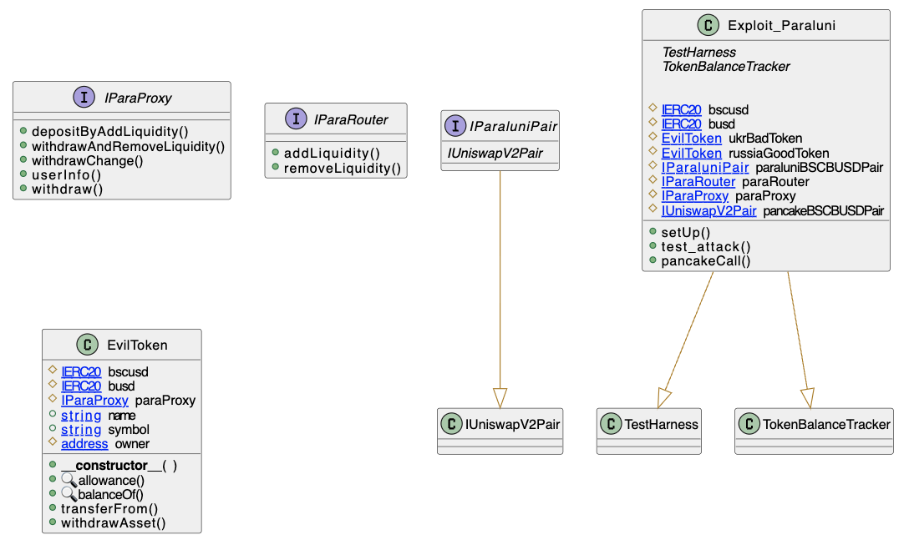

# Paraluni
- **Type:** Exploit
- **Network:** Binance Smart Chain
- **Total lost**: ~$1.7MM in various stablecoins
- **Category:** Reentrancy
- **Exploited contracts:**
- - Hundred: https://gnosisscan.io/address/0x090a00A2De0EA83DEf700B5e216f87a5D4F394FE
- **Attack transactions:**
- - Attack Tx: https://bscscan.com/tx/0x70f367b9420ac2654a5223cc311c7f9c361736a39fd4e7dff9ed1b85bab7ad54
- **Attack Block:**: 21120320 
- **Date:** Mar 15, 2022
- **Reproduce:** `forge test --match-contract Exploit_Paraluni -vvv`

## Step-by-step 
1. Create a malicious token that spoofs allowances, balances and implements a reentrant call while calling transferFrom.
2. Send stablecoins to drain to the malicious token contract. In here, USDT and BUSD.
3. Deposit into Paraluni to the malicious token as if it was a regular admitted token.

## Detailed Description

```solidity
    function depositByAddLiquidity(uint256 _pid, address[2] memory _tokens, uint256[2] memory _amounts) external{
        require(_amounts[0] > 0 && _amounts[1] > 0, "!0");
        address[2] memory tokens;
        uint256[2] memory amounts;
        (tokens[0], amounts[0]) = _doTransferIn(msg.sender, _tokens[0], _amounts[0]);
        (tokens[1], amounts[1]) = _doTransferIn(msg.sender, _tokens[1], _amounts[1]);
        depositByAddLiquidityInternal(msg.sender, _pid, tokens,amounts);
    }

    function depositByAddLiquidityInternal(address _user, uint256 _pid, address[2] memory _tokens, uint256[2] memory _amounts) internal {
        PoolInfo memory pool = poolInfo[_pid];
        require(address(pool.ticket) == address(0), "T:E");
        uint liquidity = addLiquidityInternal(address(pool.lpToken), _user, _tokens, _amounts);
        _deposit(_pid, liquidity, _user);
    }

    function addLiquidityInternal(address _lpAddress, address _user, address[2] memory _tokens, uint256[2] memory _amounts) internal returns (uint){
        //Stack too deep, try removing local variables
        DepositVars memory vars;
        approveIfNeeded(_tokens[0], address(paraRouter), _amounts[0]);
        approveIfNeeded(_tokens[1], address(paraRouter), _amounts[1]);
        vars.oldBalance = IERC20(_lpAddress).balanceOf(address(this));
        (vars.amountA, vars.amountB, vars.liquidity) = paraRouter.addLiquidity(_tokens[0], _tokens[1], _amounts[0], _amounts[1], 1, 1, address(this), block.timestamp + 600);
        vars.newBalance = IERC20(_lpAddress).balanceOf(address(this));
        require(vars.newBalance > vars.oldBalance, "B:E");
        vars.liquidity = vars.newBalance.sub(vars.oldBalance);
        addChange(_user, _tokens[0], _amounts[0].sub(vars.amountA));
        addChange(_user, _tokens[1], _amounts[1].sub(vars.amountB));
        return vars.liquidity;
    }
```
1. The deposit flow does not ensure that the token addresses provided match the addresses of the pools that are called (_pid)
2. The liquidity and internal balances (vars) are updated after adding liquidity inside addLiquidityInternal().
3. Because of 1. and 2., the deposit flow could be attacked by reentrancy as tokens flow before updating key variables and the pools allow malicious tokens.
The deposit flow will update twice the balance of the attacker contract (malicious token) transferring the double of stablecoins.

## Possible mitigations
- Ensure that the tokens addresses provided match the addresses from the targeted pool or check if they are whitelisted.
- Use a reentrancy mutex if arbitrary tokens are meant to be handled.
- Review the checks-effects-interactions pattern and evaluate the steps at which tokens flow in and out the contract.

## Diagrams and graphs

### Class



## Sources and references
- [Paraluni Tweet](https://twitter.com/paraluni/status/1502951606202994694)
- [Slowmist Article](https://slowmist.medium.com/paraluni-incident-analysis-58be442a4f99)
